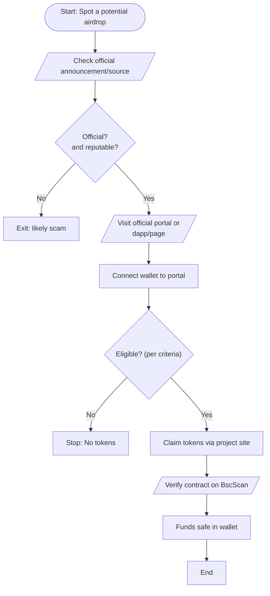

# BSCEARNER
EVM bytecode
# Safe Free BNB Chain Airdrops and Faucets

**Executive Summary:** Free token giveaways on BNB Chain (formerly BSC) can be legitimate, but scammers abound.  Valid sources include official BNB Chain programs and reputable crypto sites.  For example, BNB Chain’s own *Airdrop Alliance Program* (Chapters 1–3) offered points and tokens to retroactive users meeting certain criteria【36†L52-L60】【63†L383-L392】.  Similarly, the BNB Chain **Memecoin Daily Airdrop** (Dec 12–19, 2024) distributed 33 BNB each day among randomly selected BNB and CAKE holders【25†L330-L339】.  To claim tokens safely, always use official portals (e.g. the BNB Chain Airdrop portal on DappBay) and verify everything on [BscScan](https://bscscan.com)【47†L388-L392】.  Never pay or send crypto to “get” tokens, never share your seed/private key, and never approve unknown contracts.

## 1. Legitimate Sources (Official & Reputable)

- **BNB Chain Official (bnBChain.org)** – The BNB Chain blog and portal announce official airdrops (e.g. *Airdrop Alliance* programs【36†L52-L60】【63†L383-L392】) and link to eligibility-check pages.  Always follow links on *bnbchain.org* or verified BNB channels.【36†L52-L60】【63†L383-L392】  
- **Binance News/Blog/Square** – Binance’s official news releases or blogs often cover BNB Chain airdrops (e.g. the Chapter 1 Alliance launch【18†L31-L39】) and Binance’s *Megadrop* (staking+tasks) campaigns.  Binance’s wallet app or site may also list airdrops. For example, Binance Square guides explained “visit the BNB Chain airdrop eligibility page, connect your wallet, and check eligibility”【55†L22-L29】.  
- **BscScan (bscscan.com)** – The official BNB Smart Chain explorer【47†L388-L392】 is the authoritative source to verify any token contract or transaction.  (See section **Verifying Tokens** below.)  
- **Airdrop Aggregators** – Reputable sites list and explain active airdrops: e.g. [Airdrops.io](https://airdrops.io/)【27†L472-L481】 and [AirdropAlert](https://airdropalert.com) (BNB-specific section)【31†L119-L124】.  These help you discover opportunities but always cross-check with official sources.  
- **Project Websites/Medium** – Known BNB-chain projects may announce their own airdrops (e.g. CARV’s Medium post on its SOUL Drop【36†L52-L60】, or Rido’s campaign page【38†L68-L76】).  Always navigate by official links (project Twitter/Discord).  

## 2. Step-by-Step Claim Instructions

1. **Check Eligibility on Official Portal.**  For BNB Chain-wide drops (like Airdrop Alliance), visit the official portal on [DappBay (bnBChain.org)](https://dappbay.bnbchain.org/campaign/bnb-chain-airdrop-alliance-program)【54†L74-L82】.  Scroll to “Check eligibility” and **connect your wallet** (e.g. MetaMask, Trust Wallet) that holds your BSC address (0x28a0…2d279).  If eligible, the portal will display your level (Level 1 or 2)【55†L22-L29】.  
2. **Meet Criteria (if not already).**  Many official airdrops require specific criteria *before* snapshot dates.  For example, BNB Chain’s Alliance required staking 1+ BNB on BSC for Level 1 or 5+ BNB for Level 2 by snapshot【36†L52-L60】, or performing tasks/trades as listed by projects【63†L383-L392】.  Ensure your address meets those (e.g. check your Tx count on BscScan).  
3. **Claim via Project Page.**  If eligible for a specific project airdrop (CARV SOUL Drop, RIDO XHunt, etc.), go to that project’s claim page.  For example, CARV’s site (**protocol.carv.io/airdrop**) lets you “claim SOUL” after verifying on BscScan【36†L63-L71】.  Rido’s XHunt campaign is at *mint.rido.io/airdrop*【38†L91-L100】.  Follow on-screen prompts to connect your wallet, complete any tasks (e.g. social quests), and *claim* tokens.  Typically you enter your wallet or sign a transaction.  **Avoid** any airdrop site that asks you to send crypto first or to download files.  
   
   【56†embed_image】 *Figure: BNB Chain’s *Memecoin Daily Airdrop* poster (Dec 12–19, 2024). Hold ≥1 BNB or 235 CAKE to qualify【25†L330-L339】.*  

4. **Set Gas and Token Display:** Ensure your wallet has enough BNB for gas.  In Trust Wallet or MetaMask, use the *Send* > *Scan QR* or *Add Token (custom)* features if needed.  For example, to add a newly claimed token, copy its contract address and use “Add Custom Token” (you can sometimes scan a QR of the contract address). Always verify the contract address on BscScan first (see below).  
5. **Verify on BscScan:** Before claiming, find the token’s contract on BscScan (see **Verifying** below).  If claiming requires signing a transaction, BscScan can show you the contract’s source code and user reviews, confirming it’s the official token.  Never interact with tokens labeled “UNVERIFIED” or unknown contract addresses.  
6. **Claim the Tokens:** When you click “Claim” or sign the transaction, your wallet will ask you to approve a smart contract. **Carefully check** the request: it should clearly state the token name and amount.  Never approve any multi-token approval you didn’t intend.  After claiming, wait for the blockchain confirmation. Then check your wallet for the new token (you may need to add it via the token’s contract).  
7. **Example – BNB Chain Airdrop Alliance:** Visit the [Alliance portal on DappBay]【54†L74-L82】, click *Connect Wallet*. After connecting, it will say if you *“Passed!”* for Level 1/2. If so, you later check each project’s page to claim, as per project instructions.  

## 3. Verifying Tokens & Transactions (BscScan)

Always use the official BscScan explorer (bscscan.com) to verify any token or transaction before claiming.  BscScan is **the** Block Explorer for BNB Smart Chain【47†L388-L392】.  To verify:
- **Token Contract:** On BscScan, search the token name or address.  The contract page will show a green “Contract Source Code Verified” badge if legitimate.  Compare it against the official project info.  
- **Transactions:** Paste the transaction hash (TxID) into BscScan to confirm status and see gas spent.  
- **Token Approvals:** Under your address on BscScan, check “Token Approvals” to revoke any unintended permissions【49†L125-L133】【50†L84-L90】.  

## 4. Security Checklist (Avoid Scams)

✅ **Sources & Announcements:**  Only trust airdrops announced by official channels (project websites, BNB Chain blog/twitter, Binance blog).  If you see an airdrop “ad” or unsolicited link, be very suspicious.  Always cross-check with official sites. 【49†L125-L133】【50†L79-L86】  

✅ **Never Share Private Keys/Seed:** No legitimate airdrop will ever ask for your private key or seed phrase【50†L79-L86】.  

✅ **Never Send Crypto to Get Crypto:** Legit airdrops *do not* require you to send tokens or BNB first.  If an airdrop says “send 0.1 BNB to claim”, it’s a scam【50†L99-L101】.  

✅ **Avoid Unknown Approvals:** Do **not** approve arbitrary contract transactions or permissions.  When claiming, carefully read the wallet pop-up: it should be for the token you expect.  If it seems like giving blanket permission to an unknown contract, refuse【49†L125-L133】【50†L84-L90】.  Use tools like [Revoke.cash](https://revoke.cash) to audit and remove any previously approved permissions.  

✅ **Beware Metadata:** Fake airdrop tokens may include malicious links in their metadata or images【49†L75-L83】. Do not click on any unknown links or download files.  

✅ **Use Separate/Cold Wallets:** For high-value holdings, use a hardware wallet or a dedicated “claim wallet” with minimal funds for airdrops【49†L145-L153】【50†L79-L86】.  

## 5. Risk Assessment of Airdrop Tactics

- **Airdrop-for-Task (Quests/Referrals):** Many projects ask social tasks (Twitter, Discord, referrals) to claim tokens.  These can require a lot of time for modest reward.  If the token isn’t well-known, the future value may be low.  *Effort vs Reward:* Often high effort, uncertain payoff【52†L25-L33】.  Use caution on unknown projects; if it asks for extensive personal data or payments, skip it.  

- **Snapshot (Hold Stake):** Airdrops based on snapshots (e.g. hold X BNB by date) are common.  They require you to own a certain balance or staking.  Effort is low, but the reward depends on how many other participants share the pool.  Holding or staking BNB for an official program (like the Airdrop Alliance) is safer and low effort, but returns vary.  For example, staking 1 BNB for Alliance Chapter 1 got some points/tokens later【36†L52-L60】.  

- **Claim-with-Gas (Connect & Claim):** Some airdrops let you claim by simply connecting and signing a transaction.  Easy effort, but danger of malicious contracts.  Always verify contract addresses on BscScan first.  The Binance Wallet and Trust Wallet have built-in warning for unverified contracts, but vigilance is key.  

- **Random Drops (Auto-Receipt):** Unsolicited tokens sent to your wallet (a “dusting” attack) are **never** worth interacting with【49†L133-L136】.  They are usually a scam lure.  Always ignore or hide them.  

In general, **not every “free” token is worth the trouble**【52†L25-L33】.  Evaluate: high rewards airdrops (like Arbitrum’s $5000+) are rare.  Many small airdrops (<$5–$50 value) may cost more gas and risk than benefit.  Focus on well-audited projects or official BNB Chain programs.  

## 6. Sample Safe-Claim Flowchart

## 7. Active Airdrops/Faucets: Comparison Table

Below is a comparison of 8 notable BNB-chain token drops and faucets:

| Project / Campaign                | Legitimacy (out of 5) | Claim Method                 | Est. Reward       | Required Actions           | Link / Notes                                                |
|-----------------------------------|----------------------:|------------------------------|-------------------|----------------------------|-------------------------------------------------------------|
| **BNB Chain Airdrop Alliance (Ch3)** | 5 (Official BNB)      | Complete tasks on projects; claim on portal【63†L383-L392】 | ~8M+ tokens & points | Stake/trade: e.g. deposit $10–$50 on KiloEx, stake BNB on Stader, trade on Vooi, etc.【63†L383-L392】 | [BNB Chain Blog]【63†L383-L392】. (Jun 2024 event; official program) |
| **BNB Chain Daily Meme Airdrop**  | 5 (Official BNB)      | Hold 1 BNB or 235 CAKE by snapshot; claim randomly**【25†L330-L339】 | 33 BNB/day total (≈$20k/day) | Hold required tokens (BNB/CAKE), optionally tag #MemeOnBNB for chance【25†L330-L339】 | [BNB Chain Blog]【25†L330-L339】 (Dec 2024 memecoin campaign).  |
| **CARV SOUL Drop (Alliance)**      | 4 (High)              | Galxe/KYC tasks → claim SOUL on CARV site【36†L63-L71】 | 100M SOUL total | Stake 1–5 BNB (Level1/2), complete CARV tasks (SBT mint)【36†L63-L71】 | [CARV Medium]【36†L63-L71】 (Airdrop Alliance partner). |
| **RIDO XHunt**                    | 4 (Alliance)          | Connect wallet to *mint.rido.io/airdrop*; perform “X” mining tasks【38†L91-L100】 | $5M RIDO total【38†L68-L76】 | Follow RIDO XHunt tasks: connect Twitter, mine X posts【38†L91-L100】 | (Alliance project) via airdropsmob【38†L68-L76】. |
| **World of Dypians (WOD)**        | 4 (Alliance)          | Login to WoD game, open in-game chests during campaign【40†L92-L100】 | 1,000,000 WOD (≈$??)【40†L34-L39】 | Create game account, open daily bonus chests (free)【40†L99-L107】 | [Chainwire News]【40†L34-L39】 (4 campaigns in May–Jun 2024). |
| **BSC Testnet Faucet**            | 5 (Official)          | Visit BSC Testnet Faucet page【67†L267-L274】, enter address, solve captcha | ~0.1 tBNB per 24h | Copy wallet address into faucet form【67†L288-L297】 | [BNBChain.org Faucet](https://testnet.bnbchain.org/faucet)【67†L267-L274】 (for devs; tokens have no monetary value). |
| **QuickNode Faucet (Testnet)**    | 5 (Reputable)         | Login to QuickNode, request testnet BNB【67†L267-L274】 | ~0.03 tBNB per hour【67†L288-L297】 | Provide address, solve captcha【67†L288-L297】 | [QuickNode Guide]【67†L267-L274】 (for devs). |
| **Binance Megadrop (Wallet)**     | 5 (Official)          | Stake BNB in Simple Earn + complete wallet quests | New tokens (varies by promo) | Lock BNB on Binance, do web3 tasks (trading, learning) | [Binance Learn] for Megadrop info (official Binance program). |

**Notes:** “Legitimacy” is a rough trust score.  Official BNB Chain programs score highest.  *Estimated rewards* vary widely; airdrop pools are split among many users, so individual take is typically small.  Read all official rules and never pay money to claim tokens.  

**Sources:** Official BNB Chain and Binance announcements【36†L52-L60】【25†L330-L339】【63†L383-L392】, crypto media【18†L31-L39】【40†L34-L39】, and security guides【49†L125-L133】【50†L79-L86】【52†L25-L33】. 

